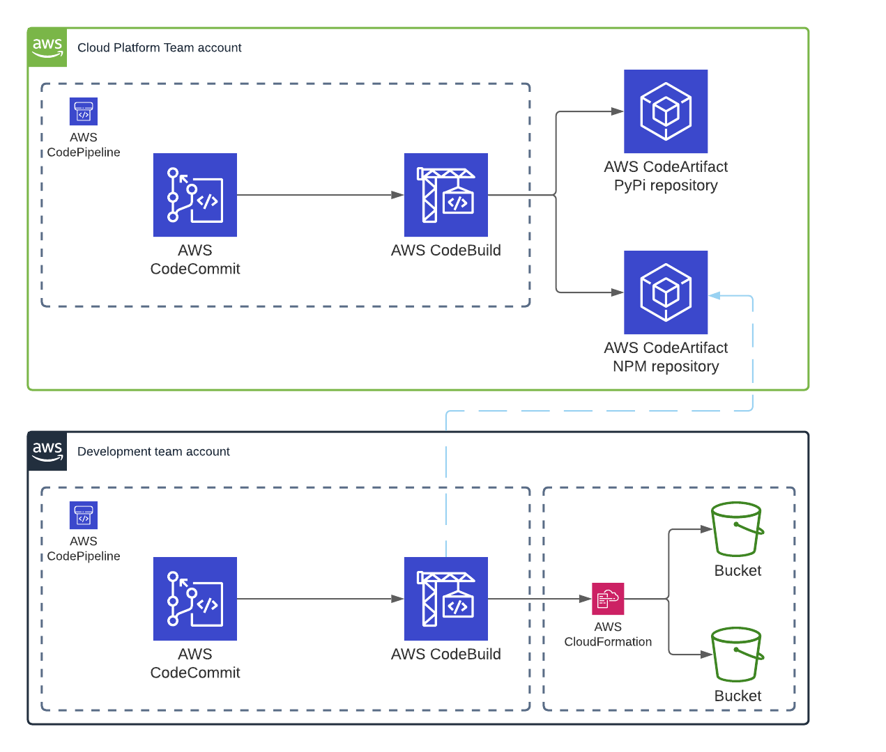

# clubcloud-construct-pipeline
This repository contains the code required to set up your first hello-world CDK construct pipeline, as demonstrated in the Club Cloud "WORKSHOP: ACCELERATE YOUR CLOUD ADOPTION WITH THE AWS CLOUD DEVELOPMENT KIT" session on November 1st 2021 at https://clubcloud.world.

This repository is first in a set of 3 Github repositories that are required to provision the end-to-end chain:
1. https://github.com/sborregodiaz/clubcloud-construct-pipeline
2. https://github.com/sborregodiaz/clubcloud-construct
3. https://github.com/sborregodiaz/clubcloud-construct-consumer

The part highlighted in green on the diagram below is the focus of this repository  

## Instructions
0. Ensure your primary AWS account has been [CDK bootstrapped](https://docs.aws.amazon.com/cdk/latest/guide/bootstrapping.html)
1. Replace the `<ORG_ID>` placeholder in the `src/pipeline-stack.ts` file with the value of your AWS Organization ID
2. Run `npx projen build`
3. Run `npx projen deploy`
4. Confirm the deployment of resources
5. Open `https://<REGION>.console.aws.amazon.com/codesuite/codecommit/repositories/clubcloud-secure-bucket-construct/setup?region=<REGION>` in your favorite webbrowser to validate the creation of your CodeCommit repository (and all the other resources)
6. Proceed with https://github.com/sborregodiaz/clubcloud-construct

## Useful links
* [CDK](https://github.com/aws/aws-cdk)
* [Projen](https://github.com/projen/projen)
* [CDK Advanced Workshop](https://cdk-advanced.workshop.aws/start.html)
* [CDK Escape Hatch](https://docs.aws.amazon.com/cdk/latest/guide/cfn_layer.html)
* [Automated CDK version bumping](https://matthewbonig.com/2021/04/06/automating-construct-publishing/)
* [Implementing GitFlow Using AWS CodePipeline, AWS CodeCommit, AWS CodeBuild, and AWS CodeDeploy](https://aws.amazon.com/blogs/devops/implementing-gitflow-using-aws-codepipeline-aws-codecommit-aws-codebuild-and-aws-codedeploy/)
* [ConstructHub](https://constructs.dev/)